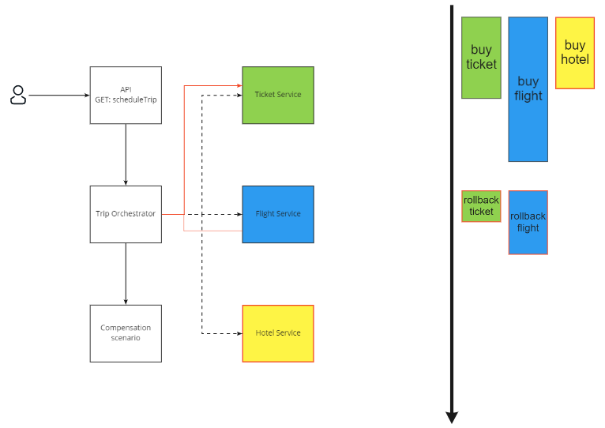

This is code from _Distributed Transactions and Eventual Consistency_ technical session demos.

# Scenario
Trip: 
1. Buy ticket
2. Book flight
3. Book hotel.

# Examples
1. [Event choreography](/Event choreography) using [Mass Transit messaging](https://masstransit-project.com/usage/messages.html)
2. [Saga](/Saga) using [Chronicle](https://github.com/snatch-dev/Chronicle)

